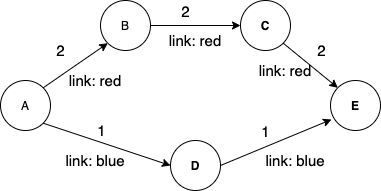

# Constrained Shortest Path First
[![GoDoc][GoDoc-Image]][GoDoc-Url]
[![License][License-Image]][License-Url]
[![Build Status][Build-Image]][Build-Url]
[![Coverage Status][Coverage-Image]][Coverage-Url]
[![Go Report Card][Report-Url]][Report-Image]

[GoDoc-Url]: https://godoc.org/github.com/bigmikes/cspf
[GoDoc-Image]: https://godoc.org/github.com/bigmikes/cspf?status.svg
[License-Url]: https://opensource.org/licenses/MIT
[License-Image]: https://img.shields.io/badge/License-MIT-yellow.svg
[Build-Url]: https://travis-ci.org/bigmikes/cspf
[Build-Image]: https://travis-ci.org/bigmikes/cspf.svg?branch=master
[Coverage-Url]: https://coveralls.io/github/bigmikes/cspf
[Coverage-Image]: https://coveralls.io/repos/github/bigmikes/cspf/badge.svg
[Report-Url]: https://goreportcard.com/badge/github.com/bigmikes/cspf
[Report-Image]: https://goreportcard.com/report/github.com/bigmikes/cspf

## Introduction
This package implements the [Constrained Shortest Path First](https://en.wikipedia.org/wiki/Constrained_Shortest_Path_First) algorithm with a generic tag system and condition-matching engine powered by [gval](https://github.com/PaesslerAG/gval).

## CSPF theory abridged
Let's assume we have the following graph, consisting of 5 vertices and edges belonging to two different categories: _red_ and _blue_. With CSPF it is possible to find out what the shortest path that connects vertex _A_ to vertex _E_ and that includes only _red_ edges is.

<p align="center">
  
</p>

CSPF uses a slightly modified version of the Dijkstra algorithm. For each round of the Dijkstra algorithm, it considers only the edges that match the constraint expression. This is basically equivalent to pruning the edges that do not satisfy the constraint from the initial graph and then runnning the Dijkstra algorithm.

## API Documentation
Documentation can be found [here](https://pkg.go.dev/github.com/bigmikes/cspf?tab=doc).

## Example
Here is an example that shows how to create a graph with labeled edges and call the CSPF algorithm on it. The graph in this example is the same showed in [the theory section](#cspf-theory-abridged).

```Go
// Create a graph with five vertices.
// A -> B -> C -> E
// A -> D -> E
var graph cspf.Graph
a := cspf.Vertex{ID: "A"}
b := cspf.Vertex{ID: "B"}
c := cspf.Vertex{ID: "C"}
d := cspf.Vertex{ID: "D"}
e := cspf.Vertex{ID: "E"}

// Create red and blue tag
tagBlue := cspf.Tag{
    Key:   "link",
    Value: "blue",
}
tagRed := cspf.Tag{
    Key:   "link",
    Value: "red",
}

// Add the edges with labels
graph.AddEdge(a, b, 2, tagRed)
graph.AddEdge(b, c, 2, tagRed)
graph.AddEdge(c, e, 2, tagRed)
graph.AddEdge(a, d, 1, tagBlue)
graph.AddEdge(d, e, 1, tagBlue)

// Run the CSPF algorithm to
// derive the graph containing
// the shortest path from A to E that 
// includes only red edges.
cspfGraph, _ := graph.CSPF(a, d, `link == "red"`)

// List the path from vertex A
// to vertex E.
paths := cspfGraph.Paths(a, e)

fmt.Println(paths)
// Output: [[{{A} {B} 2 map[link:red]} {{B} {C} 2 map[link:red]} {{C} {E} 2 map[link:red]}]]
```

## Benchmarks and performance
This package is in its early stages and there is room for improvements. Below benchmark's stats are the results of 20 repetitions with a fully-connected graph of 100 vertices. CSPF is much slower than normal SPF (Dijkstra) due to the additional complexity added by [gval](https://github.com/PaesslerAG/gval) to parse and evalaute the generic expressions.

```
goos: darwin
goarch: amd64

name      time/op
SPF-16     740µs ± 2%
Paths-16  24.7µs ± 3%
CSPF-16   3.87ms ± 4%

name      alloc/op
SPF-16    55.3kB ± 0%
Paths-16  15.2kB ± 0%
CSPF-16   1.10MB ± 0%

name      allocs/op
SPF-16       144 ± 0%
Paths-16     208 ± 0%
CSPF-16    29.9k ± 0%
```

## License 
The cspf package is licensed under the MIT License. Please see the LICENSE file for details.

## Contributing and bug reports
This package surely needs your help and feedbacks. You are welcome to open a new issue [here on GitHub](https://github.com/bigmikes/cspf/issues).
